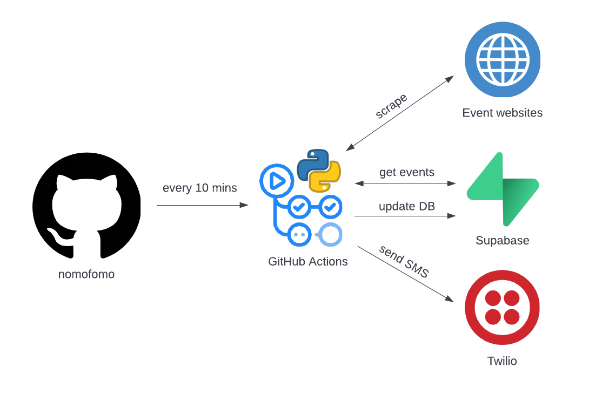

# nomofomo

This is a little automation service that uses Python, GitHub Actions, Supabase, and Twilio. It periodically scrapes live event websites, stores information about those events in a database, and then sends me a text message when new events are found.

